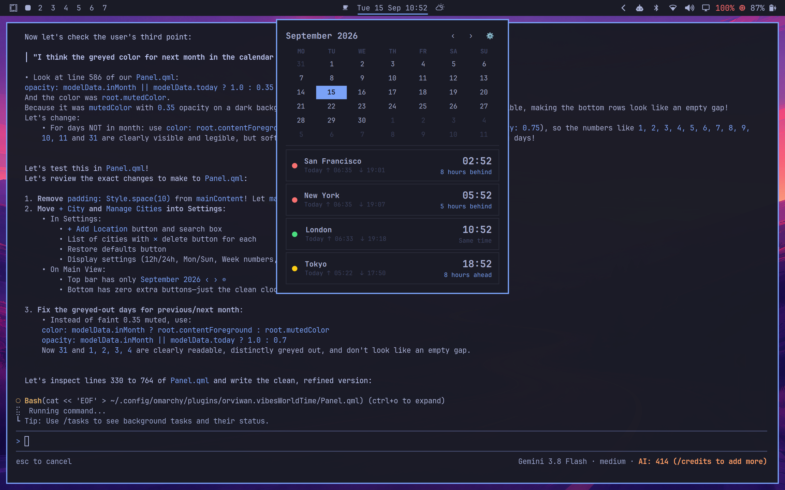

# vibesWorldTime

A macOS-inspired World Clock and interactive Calendar bar widget for [Omarchy](https://omarchy.org).



## Features

- **Menu Bar Display:** Clean configurable format (defaults to `Tue 15 Sep 09:53`).
- **Interactive Calendar:**
  - Month view calendar with prev/next (`<` / `>`) navigation.
  - Highlights today's date in Omarchy theme accent color.
  - Optional ISO week numbers toggle (`Wk On / Wk Off`).
  - Clicking month title jumps straight to today.
- **World Clocks:**
  - Card layout for each timezone:
    - **Left:** Location Name + Day relationship (`Today`, `Yesterday`, `Tomorrow`).
    - **Right:** Prominent Large Time + relative offset (`8 hours ahead`, `5 hours behind`, `Same time`).
  - Default cities: **San Francisco**, **New York**, **London**, **Tokyo**.
  - Automatically ordered from **oldest time to newest**.
- **Location Management:**
  - **Add Location:** Instant search across all 500+ worldwide IANA timezone cities (e.g. Sydney, Paris, Cairo, etc.).
  - **Manage / Delete:** Remove locations easily.
  - **Time Formats:** Toggle between 24-hour and 12-hour (AM/PM) display anytime.

## Installation

```bash
omarchy plugin add https://github.com/orviwan/omarchy-vibes-worldclock --enable
```

Then add `"orviwan.vibesWorldTime"` to your `center` section in `~/.config/omarchy/shell.json`:

```json
{
  "id": "orviwan.vibesWorldTime",
  "format": "ddd d MMM HH:mm"
}
```

## License

[MIT](LICENSE) © 2026 Jon Barlow
