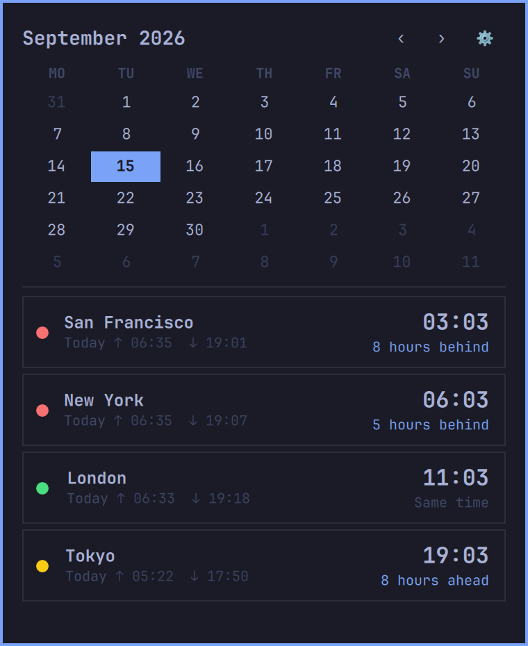
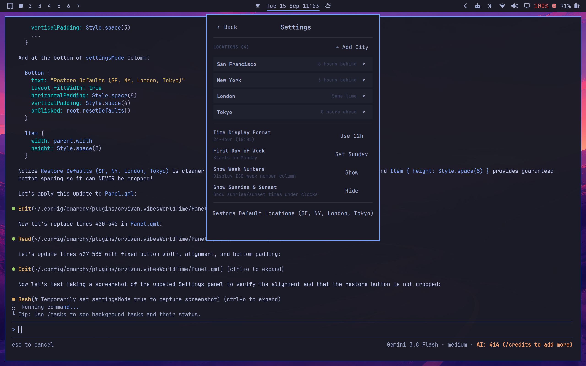

# vibesWorldTime 🌍🕒

A sleek **World Clock and Interactive Calendar** bar widget built for [Omarchy](https://omarchy.org).

Seamlessly track teammates and timezones across the globe right from your top menu bar, complete with instant city search, offline sunrise/sunset calculations, and color-coded business hour indicators.

---

<p align="center">
  
  
</p>

---

## ✨ Features

- **Top Menu Bar Clock**: Clean date & time display (`Tue 15 Sep 09:53` by default). Right-click cycles standard format presets.
- **Interactive Calendar**:
  - Month view calendar with step navigation (`‹` and `›`).
  - Highlights today's date in your Omarchy theme accent color.
  - Softly dimmed surrounding days for context.
  - Optional ISO week number column (`W`).
  - Clicking the month title jumps immediately back to today.
- **World Clocks**:
  - **Left side**: Location Name + Day relationship (`Today`, `Yesterday`, `Tomorrow`).
  - **Right side**: Prominent Large Time + relative offset (`8 hours ahead`, `5 hours behind`, `Same time`).
  - Automatically sorted from **oldest time to newest**.
- **Business Hours Status Indicator**:
  - 🟢 **Green**: Working hours (**9:00 AM – 6:00 PM**)
  - 🟡 **Yellow**: Evening winding down (**6:00 PM – 8:00 PM**)
  - 🔴 **Red**: Out of hours / night (**8:00 PM – 9:00 AM**)
- **Offline Astronomical Sunrise & Sunset**:
  - Displays daily sunrise and sunset for each location (e.g. `↑ 06:33  ↓ 19:18`) computed directly using astronomical solar zenith formulas and system timezone coordinates—zero external API calls required!
- **Dedicated Settings Panel (`⚙`)**:
  - **Search & Add Cities**: Instant search across all 500+ standard IANA worldwide timezones and major cities (e.g., Sydney, Paris, Cairo, Tokyo, etc.).
  - **Manage Locations**: Delete custom cities with one click (`✕`) or restore defaults (San Francisco, New York, London, Tokyo).
  - **Time Format**: Switch between 24-Hour (`18:05`) and 12-Hour (`6:05 PM`).
  - **First Day of Week**: Choose between **Monday** and **Sunday**.
  - **ISO Week Numbers**: Toggle week numbers column on the calendar.
  - **Sunrise / Sunset Toggle**: Turn sunrise & sunset display on or off.

---

## 💾 Configuration Storage

All your locations and preferences are automatically persisted in:
```text
~/.config/omarchy/vibesWorldTime.json
```

---

## 📦 Installation & Replacing the Default Clock

### 1. Install the Plugin

```bash
omarchy plugin add https://github.com/orviwan/omarchy-vibes-worldclock --enable
```

### 2. Replace the Default Clock in `shell.json`

Open `~/.config/omarchy/shell.json`:

1. Under `"bar"` → `"layout"` → `"center"`, replace the default `"omarchy.clock"` entry with `"orviwan.vibesworldtime"`:

```jsonc
      "center": [
        {
          "id": "omarchy.indicators"
        },
        // Replace "id": "omarchy.clock" with this:
        {
          "id": "orviwan.vibesworldtime",
          "format": "ddd d MMM HH:mm",
          "formatAlt": "d MMMM 'W'ww yyyy",
          "verticalFormat": "HH\n—\nmm"
        },
        {
          "id": "omarchy.keyboard-layout"
        }
      ]
```

2. *(Recommended)* Set `"centerAnchor"` under `"bar"` to `"orviwan.vibesworldtime"` so the top bar centers neatly around the clock:

```json
  "bar": {
    "position": "top",
    "centerAnchor": "orviwan.vibesworldtime",
    ...
```

### 3. Reload Shell

Apply the changes immediately:

```bash
omarchy restart shell
```

---

## 📄 License

[MIT](LICENSE) © 2026 Jon Barlow
